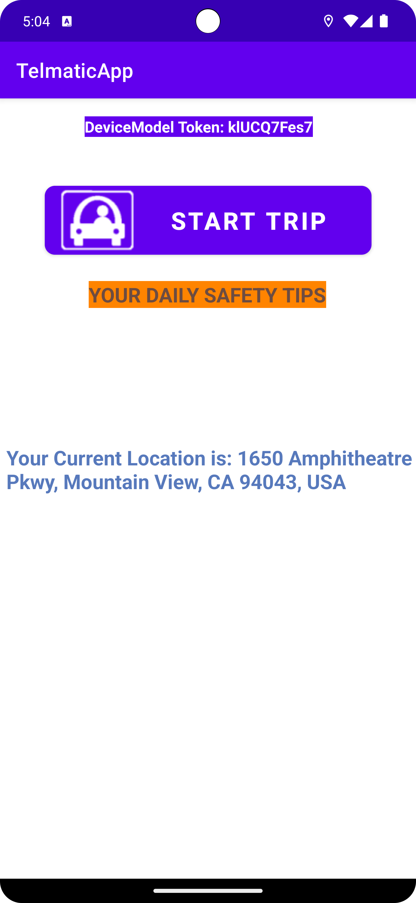

# TelmaticApp
This app is built for the purpose of collecting road driving data from drivers. It was built as part of a PhD research project for to collect data from drivers in Nigeria. It uses mobile phone sensors to collect telematic data such as acceleration, speed, address etc.

# TelmaticsApp Code Documentation

## Overview
This repository contains the source code for the TelmaticsApp, a mobile application designed to collect real-time driving data using mobile phone sensors. The app collects data at a rate of 200Hz per second and is designed to be used by drivers. This readme file provides an overview of the codebase, its structure, and instructions for using and running the code.

## App Screenshots

## Code Structure
The TelmaticsApp codebase is organized into several packages, each serving a specific purpose:

### `api`
- This package is expected to contain services that query external databases, but it's not yet fully implemented in the current version of the code.

### `db`
- Contains Data Access Objects (DAO) and defines the database schema.
- Includes the following DAOs:
  - DeviceDAO
  - LastKnownPointDAO
  - LawEstablishedDAO
  - LoginAPIResponseDAO
  - PointDAO
  - SensorDataDAO
  - TrackDAO
  - TripDetailsDAO
  - UserAPIResponseDAO
- These DAOs are organized in a subpackage called `DataAccessObjects`.
- The package also holds data model definitions for the above data access objects.

### `repository`
- Defines data access points across the application.
- This package plays a pivotal role in handling data interactions and repositories.

### `services`
- Contains the logic for handling sensors and location services.
- This is where data collection and sensor-related functionalities are implemented.

### `utility`
- Includes the `Resource` file, which tracks the state of resource access operations.
- Contains a file called `LocationMethods` that defines how correct addresses for given locations are processed and returned.

### `data`
- Collectively encompasses all the above-mentioned packages related to data management and services.

### `domain`
- Contains `repository` and `usecase` packages, which are essential for data management and business logic.

### `presentation`
- Includes `di` (Dependency Injection) and `ui` packages.
- `viewModel` package holds view models essential for the user interface.

### `AppStartHome`
- Serves as the entry point to the application.

## How to Use/Run the Code
To use or run the code, follow these steps:

1. Clone this repository to your local machine.
2. Open the code in your preferred integrated development environment (IDE).
3. Ensure you have the necessary dependencies and SDKs installed for mobile app development.
4. Configure any necessary API keys or settings for external services (if applicable).
5. Build and run the application on an emulator or a physical device.

## How to Run the Code Details

The Follow steps gives a detailed how to run of the TelmaticsApp code:

1. Clone the repository to your local machine from the GitHub repository:
   - Repository URL: https://github.com/iniakponode/TelmaticApp.git

2. Download and install Android Studio:
   - Download Android Studio from [here](https://developer.android.com/studio?gclid=CjwKCAjwvrOpBhBdEiwAR58-3LE7FdBflmz97f3P520IggRsiPOPumFz-qCVyzuAcLvsPPhnEL97oBoCh4QQAvD_BwE&gclsrc=aw.ds)

3. Open the TelmaticsApp project in Android Studio:
   - Launch Android Studio on your machine.
   - Use the 'File -> Open' option from the top-left corner of Android Studio.
   - Locate and select the folder where you cloned the TelmaticsApp repository and open the project.

4. Run the application:
   - Click on the green play button (Run button) located at the top-right corner of Android Studio.
   - This will build and launch the TelmaticsApp on an emulator or a connected Android device.

5. Using the Application:
   - Once the app is running, click on the "Start Trip" button. It will change to "Stop Trip" to indicate that the app has started recording a trip.

6. Simulate Movement:
   - If using the Android Studio emulator, you can simulate movement by using the emulator's rotate feature located at the top left corner.

7. Database Inspection:
   - You can view live sensor data in the database using the app inspection tool in Android Studio.
   - To access the database inspector, go to "View -> Tool Windows -> Database Inspector".
   - Wait for the database to load, then scroll to "telmatic_db," click to expand it, and you will see all the tables in the database.
   - The two most important tables are "sensor_data" and "trackpoint," which store trip data at a rate of 200Hz.
   - You can change the data collection rate by editing the value in the "SensorDataFromHardwareImpl.kt" file located at "data/repository/datasourceImpl/".

8. Data Extraction:
   - To extract the data, right-click on the "telmatic_db" in the database inspector.
   - You can export the data as SQL or CSV files and save it to your desired location for further processing.

9. Trip Influence Factor Data:
   - Drivers can report trip influence factor data using the form that appears after clicking the "Stop Trip" button.
   - This data is saved in the "track" table.
   - You can extract this data in the same way as described above. The two sets of data are connected by the "trackId."

10. Generating APK:
    - You can generate an APK file for installation on your Android phone.
    - Connect your Android phone to your computer with a cable or via a hotspot connection to Android Studio.
    - Ensure that the developer options on your Android phone are enabled.
    - Build and generate the APK file and install it on your Android phone.

Please note that the code is still a work in progress, and some features, such as external database interactions, may not be fully implemented in the current version.

For any questions or assistance, please contact the author of this code.

Thank you for reviewing the TelmaticsApp code. If you have any further questions or need additional information, please don't hesitate to reach out to the author.
